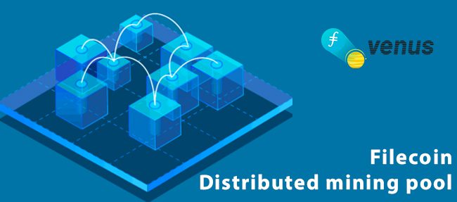
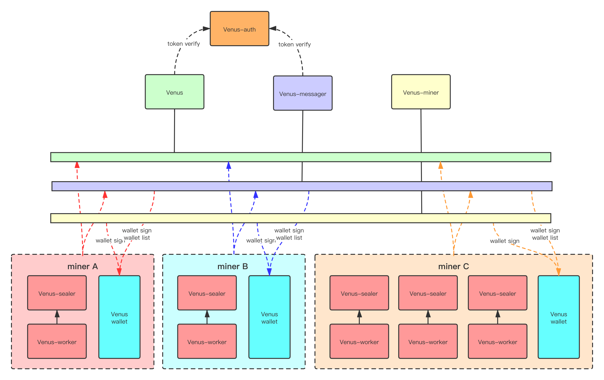

# How do access the Filecoin Miner Incubation Center

## 前言
[矿工孵化器](https://github.com/Joss-Hua/hello-word/blob/main/Filecoin%20Miner%20Incubation%20Center.md)使用[Venus的分布式矿池架构](https://github.com/filecoin-project/venus-docs/blob/master/docs/zh/Overview.md)（图1），为小矿工提供共享组件的服务，矿工只需独立运行部分组件即可运行一个或数个节点，这些节点包含一个完整矿工的所有功能。本文档面向符合[矿工孵化器](https://github.com/Joss-Hua/hello-word/blob/main/Filecoin%20Miner%20Incubation%20Center.md)申请要求的新矿工或使用Lotus的小矿工，指导其接入孵化器。

(illustration1: Venus Distributed mining pool structure) 

如果您想自行运行Venus全组件，搭建一套新的分布式矿池，可以在[这里](https://github.com/filecoin-project/venus-docs/blob/master/docs/zh/How-To-Deploy-MingPool.md)了解。或者您可能希望将您正在管理的Lotus集群切换为Venus程序，可以在[这里](https://github.com/filecoin-project/venus-docs/blob/master/docs/zh/Venus-replace-lotus.md)了解。

## 一、接入孵化器流程
### 1.接入相关接口x x x x
xxx

### 2.网关xxx
xxx

### 3.xxx
xxx

## 二、相关文档
以上流程所使用的程序来自开源的[Lotus](https://github.com/filecoin-project/lotus/releases)及[Venus](https://github.com/filecoin-project/venus/releases)代码，部署或接入过程可能会碰到多种问题，比如组件、网络、网关、参数、命令、硬件等，矿工可以进一步了解[Venus常用命令](https://github.com/filecoin-project/venus-docs/blob/master/docs/zh/Commands.md)、[venus-messager如何使用](https://github.com/filecoin-project/venus-docs/blob/master/docs/zh/How%20to%20use%20venus%20messager.md)、
[Venus远程钱包](https://github.com/filecoin-project/venus-docs/blob/master/docs/zh/Venus%20wallet.md)、[Venus多签钱包](https://github.com/filecoin-project/venus-docs/blob/master/docs/zh/Multisig-Wallet.md)以及[venus-wallet如何使用]（https://github.com/filecoin-project/venus-docs/blob/master/docs/zh/How-To-Use-Wallet.md)。Venus提供了[常见问题指南](https://github.com/filecoin-project/venus-docs/blob/master/docs/zh/Troubleshooting-%26-FAQ.md)可以帮组你解决一些问题。

## 三、其他资源
您需要通过[venus-sealer](https://github.com/filecoin-project/venus-sealer)做数据的封装，通过[venus-woker](https://github.com/filecoin-project/venus-docs/blob/master/docs/zh/Venus-Worker.md)与venus-sealer的配合将更好的执行seal的任务。

理论上[venus-wallet](https://github.com/filecoin-project/venus-wallet)可以运行在共享组件部分，但基于矿工的安全性需求，venus-wallet可以由矿工独立部署，就像图1那样。

## 四、人员
接入孵化器的操作过程如果遇见更多问题，请联系[Venus Team](https://filecoinproject.slack.com/archives/CEHHJNJS3) - @[hunjixin](https://filecoinproject.slack.com/team/USSCQ7WGM)、@[moliujian](https://filecoinproject.slack.com/team/UP4KR85FT)。
